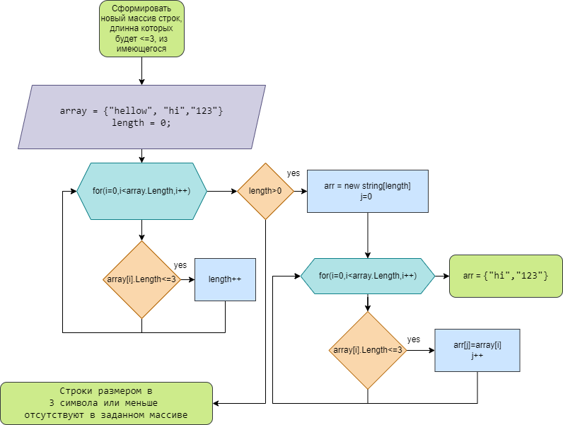

## Шаги выполнения задания
* Создан репозиторий и добавлен readme файл
* Создана блок-схема

* Пишем код состоящий из: 
    1. Создания метода печати массива
    2. Создания метода копирования массива с нужным нам условием
    3. Задаем массив
    4. Узнаем количество элементов массива подходящее под условие задачи, оно же будет длинной нового массива
    5. Если такие элементы есть, выполняем методы и выводим получившийся массив в консоль, если же их нет, сообщаем об этом.
# Конец